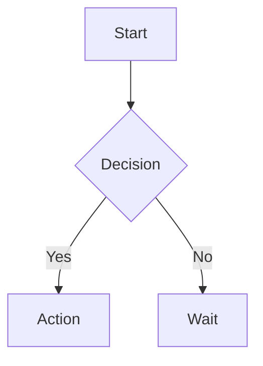
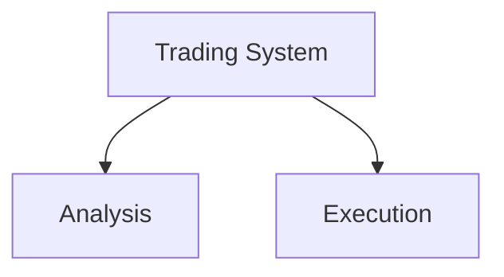

# Examples - YouTube & Google Drive Transcript Service

## Example 1: YouTube Trading Video with Diagrams

### Request:
```bash
curl -X POST "http://localhost:8000/transcribe" \
  -H "Content-Type: application/json" \
  -d '{
    "url": "https://youtu.be/qkW6VHPNuu8",
    "generate_summary": true,
    "summary_language": "id",
    "generate_diagrams": true
  }'
```

### Response:
```json
{
  "source_type": "youtube",
  "video_id": "qkW6VHPNuu8",
  "title": "CRT 2026 Mentorship EP 2 | LTF Methodology & Model-1",
  "transcript": [
    {"text": "Halo semuanya, hari ini kita bahas LTF methodology", "start": 0.0, "duration": 3.5},
    {"text": "Pertama, kita identifikasi trend di higher timeframe", "start": 3.5, "duration": 4.0}
  ],
  "full_text": "Halo semuanya, hari ini kita bahas LTF methodology. Pertama, kita identifikasi trend...",
  "summary": "Video ini membahas Lower Time Frame methodology untuk trading dengan fokus pada Model-1. Poin utama meliputi identifikasi trend, entry point, dan risk management...",
  "duration_seconds": 1234,
  "diagrams": {
    "diagrams": {
      "flowchart": "graph TD\n    A[Start: Open Chart] --> B{Higher TF Trend?}\n    B -->|Bullish| C[Look for Buy Setup]\n    B -->|Bearish| D[Look for Sell Setup]\n    C --> E[Identify Key Level]\n    D --> E\n    E --> F{Price Action Signal?}\n    F -->|Yes| G[Enter Trade]\n    F -->|No| H[Wait]\n    G --> I[Set Stop Loss]\n    I --> J[Set Take Profit]\n    J --> K[Manage Position]\n    style A fill:#e1f5fe,stroke:#01579b,stroke-width:2px\n    style B fill:#fff3e0,stroke:#e65100,stroke-width:2px\n    style G fill:#e8f5e9,stroke:#1b5e20,stroke-width:2px",
      "mindmap": "mindmap\n  root((LTF Methodology))\n    Trend Identification\n      Higher Timeframe\n      Market Structure\n    Entry Strategy\n      Price Action\n      Key Levels\n      Confirmation\n    Risk Management\n      Position Size\n      Stop Loss\n      Take Profit\n    Psychology\n      Patience\n      Discipline\n      Review",
      "sequence": "sequenceDiagram\n    Trader->>Chart: Analyze Higher TF\n    Chart-->>Trader: Trend Direction\n    Trader->>Chart: Wait for LTF Setup\n    Chart-->>Trader: Price Action Signal\n    Trader->>Platform: Submit Order\n    Platform-->>Trader: Trade Opened\n    Trader->>Platform: Set SL/TP\n    Platform-->>Trader: Order Confirmed"
    },
    "analysis": {
      "primary_type": "flowchart",
      "secondary_types": ["mindmap", "sequence"],
      "confidence": 0.92,
      "reasoning": "Video contains trading system with clear decision points and process flow"
    },
    "recommended": "flowchart"
  }
}
```

---

## Example 2: YouTube Playlist with Diagrams

### Request:
```bash
curl -X POST "http://localhost:8000/transcribe" \
  -H "Content-Type: application/json" \
  -d '{
    "url": "https://www.youtube.com/playlist?list=PLexample",
    "generate_summary": true,
    "generate_diagrams": true,
    "combine_playlist_summary": true
  }'
```

### Response (excerpt):
```json
{
  "source_type": "youtube_playlist",
  "video_id": "PLexample",
  "total_videos": 3,
  "video_results": [
    {
      "video_id": "abc123",
      "summary": "Video 1: Introduction to LTF...",
      "diagrams": {
        "flowchart": "graph TD\n    A[Intro] --> B[Basic Concepts]...",
        "recommended": "flowchart"
      }
    },
    {
      "video_id": "def456",
      "summary": "Video 2: Advanced Entry...",
      "diagrams": {
        "flowchart": "graph TD\n    A[Entry Rules] --> B{Signal?}...",
        "recommended": "flowchart"
      }
    }
  ],
  "summary": "COMBINED: Playlist ini membahas LTF methodology secara lengkap dari dasar hingga advanced...",
  "diagrams": {
    "recommended": "mindmap",
    "analysis": {
      "primary_type": "mindmap",
      "reasoning": "Playlist covers multiple interconnected trading concepts"
    }
  }
}
```

---

## Example 3: Google Drive Video with Timeline

### Request:
```bash
curl -X POST "http://localhost:8000/transcribe" \
  -H "Content-Type: application/json" \
  -d '{
    "url": "https://drive.google.com/file/d/VIDEO_ID/view",
    "generate_summary": true,
    "generate_diagrams": true,
    "summary_language": "id"
  }'
```

### Response:
```json
{
  "source_type": "gdrive",
  "video_id": "1a2b3c4d5e",
  "full_text": "Weekly trading review. Monday: Made 3 trades on EURUSD. Tuesday:...",
  "summary": "Review mingguan ini menampilkan performa trading dengan 5 trade total, win rate 60%, dan profit factor 1.8...",
  "diagrams": {
    "diagrams": {
      "timeline": "timeline\n    title Weekly Trading Review\n    Section Monday\n      09:30 : EURUSD Buy - Win\n      14:00 : GBPUSD Sell - Loss\n    Section Tuesday\n      10:15 : USDJPY Buy - Win\n      15:30 : XAUUSD Sell - Win\n    Section Wednesday\n      11:00 : EURUSD Sell - Win\n    Section Thursday\n      09:00 : No Trade - Wait for Setup\n    Section Friday\n      13:00 : GBPUSD Buy - Loss"
    },
    "recommended": "timeline",
    "analysis": {
      "primary_type": "timeline",
      "confidence": 0.95,
      "reasoning": "Video is a daily/weekly review with time-based trade entries"
    }
  }
}
```

---

## Example 4: Disable Diagrams (Summary Only)

### Request:
```bash
curl -X POST "http://localhost:8000/transcribe" \
  -H "Content-Type: application/json" \
  -d '{
    "url": "https://youtu.be/qkW6VHPNuu8",
    "generate_summary": true,
    "generate_diagrams": false
  }'
```

### Response:
```json
{
  "source_type": "youtube",
  "video_id": "qkW6VHPNuu8",
  "summary": "Video ini membahas...",
  "diagrams": null
}
```

---

## How to Use Mermaid Diagrams

### In GitHub README:
```markdown

```

### In Notion:
1. Type `/code`
2. Select language: `mermaid`
3. Paste the diagram code

### In Obsidian:
```

```

### Online Renderer:
- https://mermaid.live (paste code, get PNG/SVG)
- https://mermaid.js.org/live-editor

---

## Diagram Types Explained

| Type | Best For | Example Use |
|------|----------|-------------|
| **Flowchart** | Trading systems, decision processes | Entry/exit rules, risk management flow |
| **Mindmap** | Concepts, strategies, knowledge | Trading concepts, strategy components |
| **Timeline** | Reviews, schedules, events | Daily/weekly reviews, trade history |
| **Sequence** | Process flows, interactions | Trade execution flow, system architecture |
| **Gantt** | Plans, schedules | Trading plan timeline, position management |

---

## Tips for Best Results

1. **Clear Audio**: Videos with clear narration produce better diagrams
2. **Structured Content**: Systematic explanations work best for flowcharts
3. **Specific Topics**: Videos focused on one topic generate better mindmaps
4. **Time References**: Reviews with timestamps create accurate timelines

---

## Troubleshooting

### Diagram not generated:
- Check logs for errors
- Ensure transcript is not empty
- Verify LITELLM_API_KEY is set

### Diagram looks wrong:
- Try different diagram type manually
- Adjust video quality/audio clarity
- Provide more specific prompt in future versions
